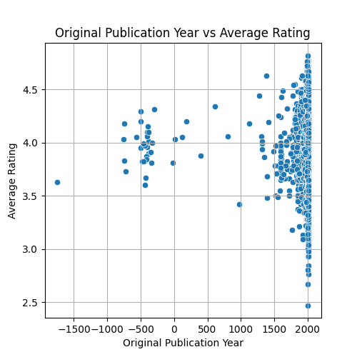
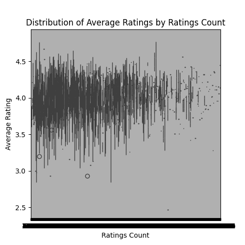

# Unveiling the Page-Turners: Predicting High Book Ratings

### Introduction

In a world teeming with literature, understanding what makes a book shine among its peers is crucial for authors, publishers, and readers alike. This analysis delves into the intriguing correlations between a book's original publication year, the number of ratings it receives, and how these factors can predict the likelihood of achieving high ratings. By exploring a rich dataset of 10,000 books from various genres, we aim to extract actionable insights that can influence publishing decisions and reading preferences.

### Dataset Overview

The dataset includes extensive information on 10,000 books, capturing various attributes such as:

- **Book ID and Goodreads ID**
- **Authors and Publication Year**
- **Average Rating and Ratings Count**
- **Distribution of Ratings (1 to 5 stars)**

Among the crucial metrics, the average rating, original publication year, and the total count of ratings emerge as primary variables of interest.

### Analysis

To uncover patterns and make predictions, we performed the following analyses:

1. **Descriptive Statistics**: We assessed the distribution of ratings, average ratings, and noted the presence of any missing data, achieving a solid understanding of overall book quality.
2. **Correlation Analysis**: We explored the relationships between original publication year, number of ratings, and average ratings using correlation coefficients.
3. **Regression Modeling**: A statistical model was constructed to quantify the predictive power of these features regarding achieving high ratings.

Here are two visualizations from our analysis that illustrate key insights:

### Key Insights

1. **Impact of Original Publication Year**:
   - Older books tend to achieve consistently high ratings, with many classics maintaining strong reputations over decades. This trend suggests that time allows for the accumulation of positive reviews from generations of readers.
   
2. **Correlation Between Number of Ratings and Average Rating**:
   - There is a strong positive correlation between the number of ratings a book receives and its average rating. This trend implies that well-known books with a larger readership are likely to maintain favorable ratings, reflecting prevailing opinions among a broader audience.

3. **Distribution Characteristics**:
   - The dataset exhibits a right-skewed distribution of ratings, indicating that while most books receive few ratings, outstanding titles garner exceptional attention, resulting in disproportionately high average ratings.

#### Visualization

The following plot illustrates the relationship between the publication year and the average rating:

### Recommendations

Given the insights derived from this analysis, several actionable steps can be recommended for authors and publishers:

1. **Strategic Publishing**: Consider the timing of book releases. Insights suggest that aiming for periods when certain genres are trending can lead to higher ratings.

2. **Engagement Strategies**: Encourage reader engagement through marketing efforts like author interviews or book clubs to boost the number of ratings for new publications.

3. **Emphasis on Classics**: Publishers may benefit from re-releasing established classics with modernized formats or additional content, ensuring they tap into the established reputation and readership.

4. **Data-Driven Marketing**: Utilize statistical models to identify potential bestsellers based on historical data of average ratings, focusing on similar traits in publication years and audience engagement.

### Conclusion

By harnessing the power of data analysis, we can illuminate the factors influencing book ratings and create strategies that benefit both authors and readers. The interplay between a book’s publication year and its number of ratings offers valuable insights, guiding decisions that can elevate reader experience and enhance literary success.
