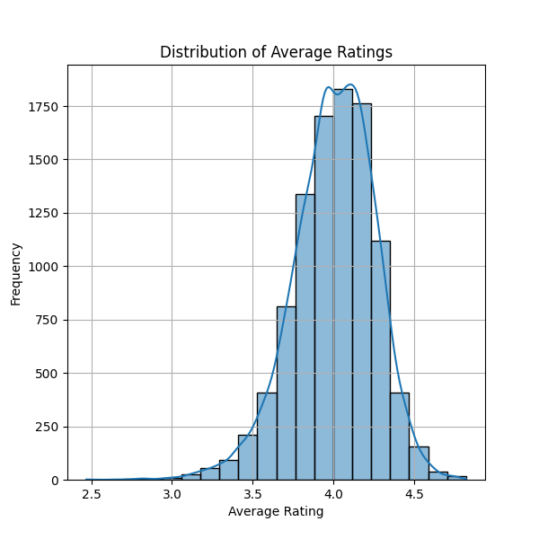

# Unpacking the Relationship Between Text Reviews and Average Ratings: A Dive into Book Popularity

In an increasingly digitized world, reviews play an essential role in shaping public perception. Understanding the intricate relationships between ratings, reviews, and subsequently, book popularity can unveil significant insights for authors, publishers, and readers alike. Our analysis delves into a comprehensive dataset derived from popular literary works, aiming to expose the networks between text reviews and average ratings.

## Dataset Overview

The analysis is based on a curated dataset containing data on **10,000 popular titles**. Key attributes of this dataset include:

- **Book Identifiers**: Unique IDs and ISBNs that facilitate tracking.
- **Authors**: Insights into diverse contributions from numerous writers.
- **Year of Publication**: Information on when a work was introduced to the market.
- **Ratings**: Metrics including average ratings, total ratings, and work text reviews count.

The primary variables of interest are **average_rating** and **work_text_reviews_count**, as the aim is to understand how the volume of reviews impacts the average rating of these titles.

## Analytical Insights

### Key Insights from the Dataset

**1. Strong Correlation Between Text Reviews and Ratings**

Initial exploration indicates a positive correlation between the **count of text reviews** and **average ratings**. Higher engagement with text reviews appears to correspond with better reception among readers. 

**2. Distribution of Ratings and Text Reviews**

The mean average rating in the dataset is **4.00**, while the count of text reviews averages around **2,920** reviews per title, indicating that popular titles tend to garner extensive feedback. In particular, titles with more reviews often achieve higher ratings, suggesting that audience engagement correlates with satisfaction.

**3. Examination of Ratings Over Time**

Looking at the **original publication year** against average ratings reveals interesting trends — older titles tend to have more established reviews but also carry varying perspectives due to time. This may imply that while more contemporary titles gain traction quickly, they may not reach the acclaim of enduring classics immediately.

## Implications and Suggested Actions

### Evaluating the Findings

The positive correlation between the volume of text reviews and average ratings suggests that promoting user engagement can significantly enhance a work's perceived quality in the literary market. Engaged readers not only provide more insights but might also attract new audiences.

### Recommended Actions

1. **Encourage Reader Participation**: Authors and publishers should foster an environment that motivates readers to leave detailed reviews, perhaps through incentives such as exclusive content or giveaways.

2. **Engage Themes**: Publishing campaigns should focus on themes that resonate with critical audiences, driving up the potential for reviews and increasing ratings simultaneously.

3. **Monitor Trends in Ratings**: Publishers should consider demographic shifts and changes over time, as audience feedback on older titles may shift as new contexts emerge.

## Conclusion

The relationship between text reviews and average ratings within popular titles reveals a pivotal understanding: engaging readers to provide more feedback can enhance perceived quality. This analysis not only underscores the importance of reader reviews but also highlights avenues for further exploration into the world of titles and their legacies. In a data-driven market, leveraging such insights is crucial for authors and publishers aiming to thrive in today’s competitive landscape.
