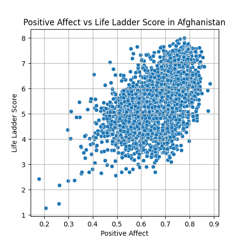
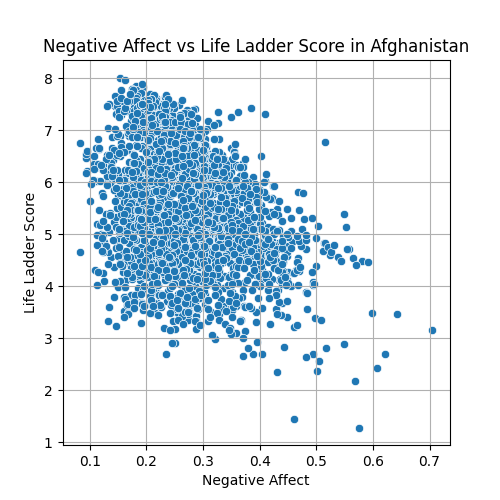
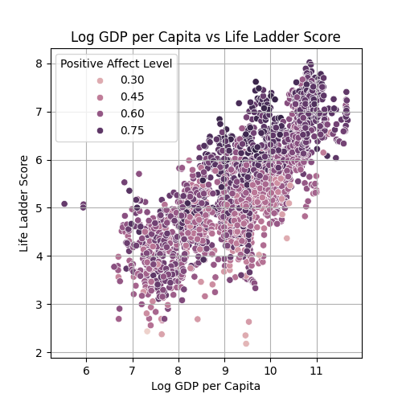

# The Dynamics of Well-Being: Understanding Life Satisfaction in Afghanistan 

## Introduction

In the realm of socio-economic research, understanding the psychological factors influencing overall well-being is crucial. This analysis focuses on Afghanistan, examining how emotional experiences—specifically Positive and Negative affect—impact the country's Life Ladder score. The Life Ladder serves as a subjective indicator of life satisfaction, and exploring its associations with emotional dimensions and socio-economic conditions reveals important insights into the quality of life for Afghan citizens.

## Dataset Overview

The dataset provided includes key variables related to the well-being of individuals in Afghanistan, notably:

- **Life Ladder**: A reflective score of life satisfaction.
- **Log GDP per capita**: An economic indicator representing income levels.
- **Social support**: A measure of community and relationship strength.
- **Healthy life expectancy at birth**: A health-related measure.
- **Freedom to make life choices**: The degree of autonomy individuals feel.
- **Generosity**: The propensity to give to others.
- **Perceptions of corruption**: Trust levels in governance.
- **Positive and Negative affect**: Emotional dimensions affecting life satisfaction.

### Key Insights from the Analysis

1. **The Role of Positive Affect**
   - The data shows a strong correlation between Positive affect and the Life Ladder score, suggesting that higher emotional positivity increases life satisfaction among Afghan citizens.  

2. **The Impact of Negative Affect**
   - Negative affect exhibits a significant negative correlation with the Life Ladder score, indicating that increased feelings of sadness or anxiety correspond with lower self-reported levels of life satisfaction.

3. **Socio-Economic Moderators**
   - Log GDP per capita and social support were identified as strong moderators between affective states and the Life Ladder score. Higher economic conditions coupled with strong social support networks enhance Positive affect and mitigate Negative affect.

### Insights Implications

- **Mental Health Initiatives**: Improving Positive affect through mental health programs (like therapy and community engagement) can enhance overall life satisfaction.
- **Resiliency and Coping Strategies**: Programs aimed at increasing resilience in the face of socio-economic challenges can counterbalance the effects of Negative affect.
- **Community Support Structures**: Strengthening social support networks can lead to increased Positive affect and decreased Negative affect, reflecting a dual-enhancing effect on well-being.

## Recommendations

Based on the analysis and its insights, the following actions are suggested:

1. **Promote Positive Psychology**: Initiatives like community centers that focus on social cohesion and engagement could harness Positive affect, potentially raising the Life Ladder scores. 

2. **Address Mental Health Concerns**: Implement training programs for healthcare workers to identify and treat mental health issues, enabling residents to cope with Negative affect more effectively.

3. **Economic Empowerment Programs**: Targeted economic programs emphasizing job creation and financial education can improve GDP per capita, enhancing both Positive affect and social support.

4. **Community Support Initiatives**: Encouraging community participation in local governance can foster a sense of belonging and freedom to make life choices, positively influencing life satisfaction.

Overall, by attending to both emotional health and socio-economic conditions, Afghanistan can work towards enhancing the well-being of its populace, indicated through improved Life Ladder scores. The journey to improved life satisfaction is interwoven with the emotional fabric of its citizens, requiring careful consideration of both Positive and Negative affects.
