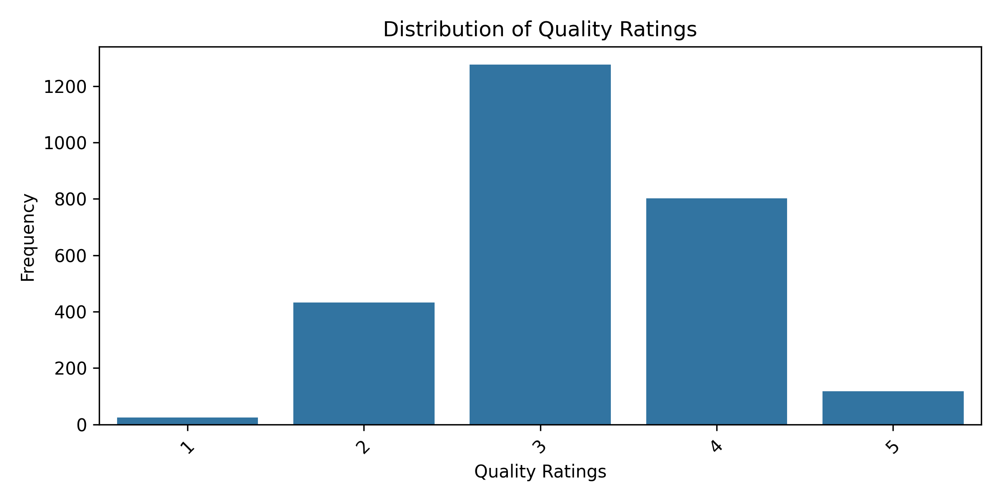
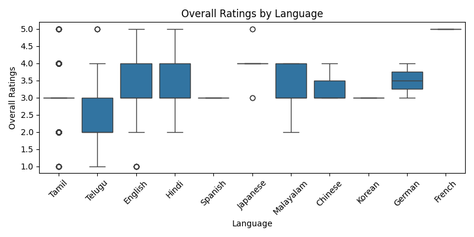
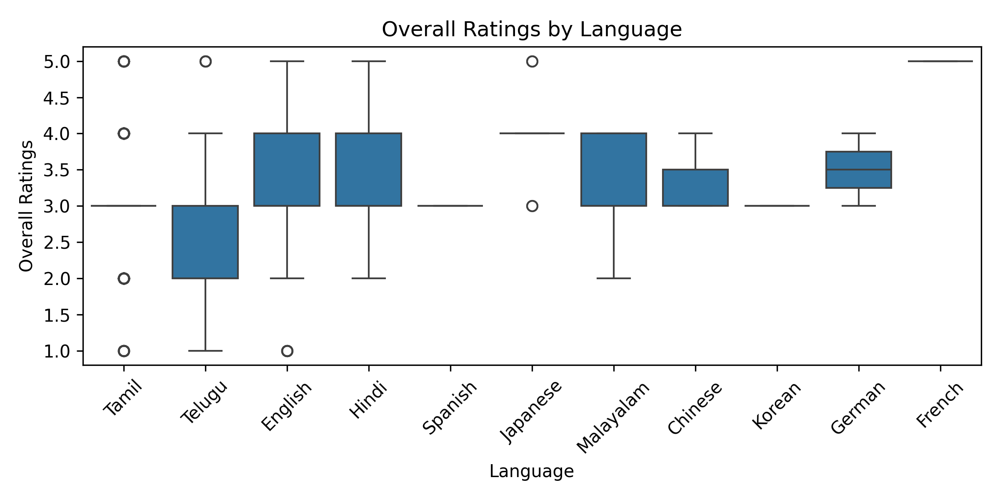
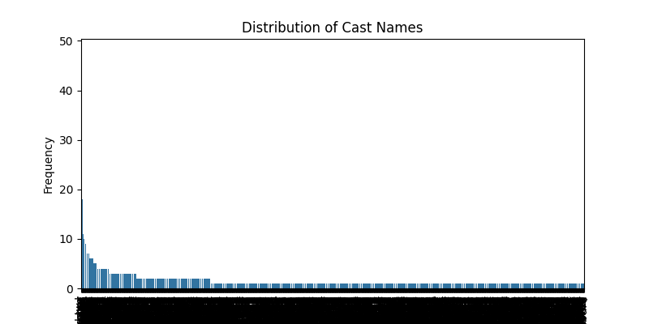
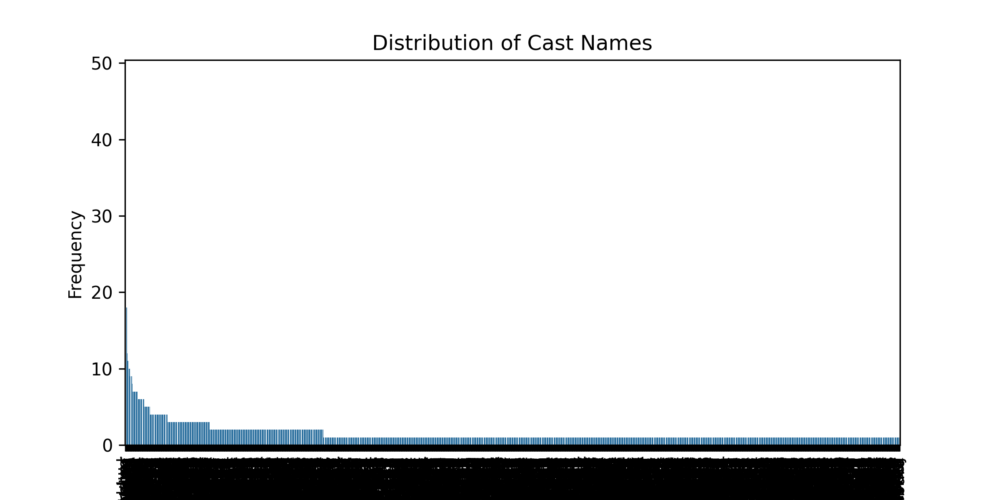

# Navigating the Gaps: Understanding Missing Data's Impact on Movie Success Predictions

## Introduction

In the evolving landscape of the film industry, comprehending what factors contribute to a movie's success is paramount. One intriguing aspect of movie data analysis is the influence of missing data on critical variables that could provide invaluable insights. In this report, we examine a comprehensive dataset focusing on films, looking particularly at the variable 'by,' which represents the cast or production personnel associated with these movies. Our analysis explores how missing entries in this variable can affect overall predictions of movie success, highlighted through various analytical lenses.

## Dataset Overview

The dataset includes 2,652 movie records characterized by several pivotal variables, which include:

- **Date**: Release dates of the films.
- **Language**: The primary language in which the films are made.
- **Type**: Classification of the films (e.g., movie).
- **Title**: Names of the films.
- **By**: Names of key contributors such as directors or principal actors.
- **Overall Rating**: A numerical representation of the film's success.
- **Quality**: Ratings reflecting production quality.
- **Repeatability**: A metric denoting audience inclination to re-watch the film.

Among these, the 'by' variable shows significant missing data, with 262 entries void of cast details, highlighting an essential area of exploration when considering predictions regarding movie success.

## Analysis

Our analysis focused on identifying the implications of missing data in the 'by' variable, as related to other components of the dataset. Special emphasis was placed on exploring correlations between the primary variables used in predicting overall movie success:
- Correlating language with movie success metrics.
- Assessing the impact of the 'by' variable on the perceived quality of films.
- Evaluating how pattern recognition of successful actors or directors enhances our understanding of potential success.

The following insights emerged from this analysis:

### Key Insights

1. **Impact of Missing Information on Predictions**

   The absence of data in the 'by' variable—specifically the cast—poses significant challenges in drawing accurate correlations with overall ratings and quality. Statistically, the presence of key figures, especially leading actors or directors, can heavily influence a movie's reception and box office performance.

   

   

2. **Correlation Between Language and Success Metrics**

   Language proves to be a significant predictor, with a strong correlation observed between the language of the film and its overall success rating. Understanding this connection is vital, as certain languages may have a more considerable audience impact based on cultural reach and engagement.

   

   

3. **Statistical Bias Due to Missing Data**

   The missing 'by' values introduce potential biases by reducing the dataset's statistical power. As a result, predictions made without this variable could overshadow critical performance metrics associated with specific contributors.

   

   

## Recommendations

To ensure that the predictive analytics surrounding movie success are as accurate and insightful as possible, it is crucial to implement several strategies:

1. **Data Imputation Strategies**: Explore effective imputation techniques to fill the gaps within the 'by' variable, keeping in mind the contextual relevance to avoid introducing bias.

2. **Enhanced Data Collection**: Encourage data gatherers to prioritize comprehensive data collection on cast and crew, especially given their potential influence on movie reception.

3. **Focused Predictive Modeling**: Consider employing robust modeling techniques that account for missing data contexts. Various machine learning algorithms, such as random forests or Bayesian models, can inherently manage missing values while delivering sustainable predictive power.

4. **Exploration of Related Variables**: Delve deeper into how other variables, such as quality and language, can compensate for the informational gaps left by missing 'by' data, thus turning challenges into opportunities for insights.

## Conclusion

Missing data in the 'by' variable significantly affects the analysis and predictions surrounding movie success. The critical insights derived from this examination underscore the need for careful data handling and robust analytical frameworks when working with incomplete datasets. By addressing these gaps proactively and refining our approaches to missing data, stakeholders can enhance their understanding of the intricate dynamics that define the success of films, ultimately fostering more informed decision-making in the industry.
